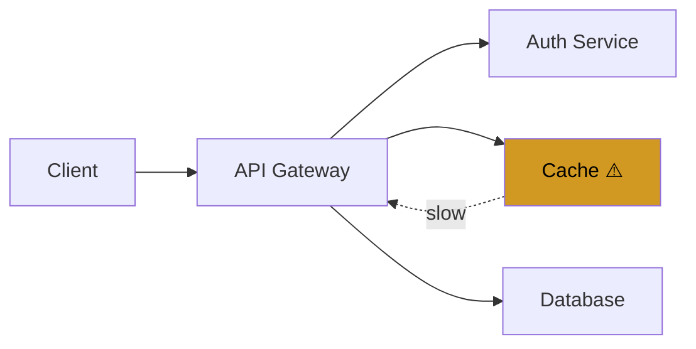

# Incident Response Skill

When the user reports an incident or asks about service issues, follow this procedure.

## Procedure

1. **Assess severity** based on impact:
   - 🔴 **P1 Critical**: Service down, data loss, security breach
   - 🟠 **P2 High**: Major feature broken, significant performance degradation
   - 🟡 **P3 Medium**: Minor feature broken, workaround available
   - 🔵 **P4 Low**: Cosmetic issue, minor inconvenience

2. **Show current status** with inline cards:

```
<!-- card: {"id":"incident-status","type":"error","title":"🔴 INC-2024-042: Cache Latency Spike","content":"**Service:** cache-redis\n**Started:** 15 min ago\n**Impact:** 15% of requests experiencing >500ms latency\n**Assignee:** oncall-team"} -->
```

3. **Visualize the affected path** with a mermaid diagram:



4. **Guide troubleshooting** with steps:

```
<!-- steps: {"id":"runbook","steps":[{"label":"Check metrics","status":"active"},{"label":"Review logs","status":"pending"},{"label":"Identify root cause","status":"pending"},{"label":"Apply fix","status":"pending"},{"label":"Verify resolution","status":"pending"}]} -->
```

5. **Offer next actions**:

```
<!-- suggestions: [{"label":"Check metrics","text":"Show me the cache metrics for the last hour"},{"label":"View logs","text":"Show me recent cache error logs"},{"label":"Escalate","text":"Escalate this incident to the database team"}] -->
```
