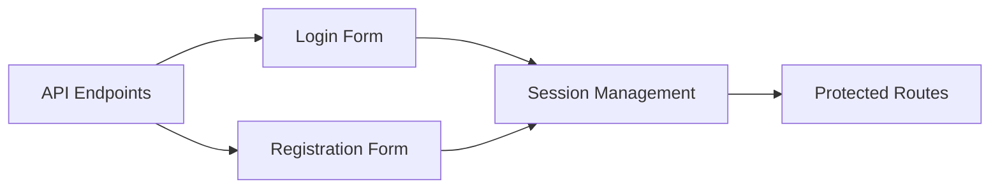

# Sprint Planning Skill

When the user asks to plan a sprint or break down a feature, follow this procedure.

## Procedure

1. **Understand scope**: Ask clarifying questions about the feature or sprint goals.

2. **Break down tasks** with estimates:
   - Each task should be 1-3 days of work
   - Include acceptance criteria
   - Identify dependencies between tasks

3. **Present as task cards** using inline blocks:

```
<!-- card: {"id":"task-1","type":"tip","title":"📋 Task: User Login Form","content":"**Estimate:** 2 days\n**Depends on:** API endpoints\n**AC:** Email/password form with validation, error states, loading spinner"} -->
```

4. **Show dependencies** with a mermaid diagram:



5. **Summarize sprint capacity**:

```
<!-- progress: {"id":"sprint-capacity","label":"Sprint Capacity","current":13,"total":20,"style":"bar"} -->
```

6. **Offer next steps**:

```
<!-- suggestions: [{"label":"Adjust estimates","text":"Let me adjust the task estimates"},{"label":"Add more tasks","text":"Add more tasks to this sprint"},{"label":"Show kanban board","text":"Show the sprint as a kanban board"}] -->
```
