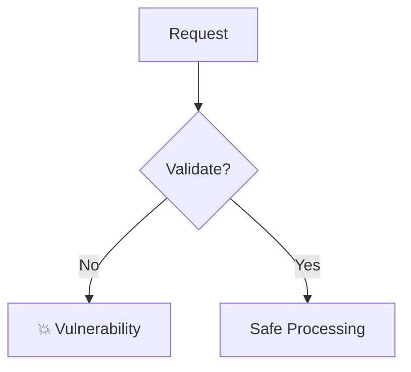

# Review Skill

When the user asks you to review code, follow this procedure.

## Procedure

1. **Identify the target**: If the user specified a file, read it. If they pasted code, use that directly.

2. **Analyze the code** for these categories:
   - 🔴 **Critical**: Bugs, crashes, data loss, security vulnerabilities
   - 🟡 **Warning**: Performance issues, race conditions, missing error handling
   - 🔵 **Suggestion**: Style improvements, readability, maintainability

3. **Present findings** using inline blocks:

```
<!-- card: {"id":"critical-1","type":"error","title":"🔴 SQL Injection","content":"User input is concatenated directly into the query string. Use parameterized queries instead."} -->
```

4. **Show architecture** with a mermaid diagram if the code has structural issues:



5. **Summarize** with a progress-style overview:

```
<!-- progress: {"id":"review-score","label":"Code Health","current":7,"total":10,"style":"bar"} -->
```

6. **Offer next steps** with suggestions:

```
<!-- suggestions: [{"label":"Fix critical issues","text":"Help me fix the critical issues you found"},{"label":"Review another file","text":"Review another file"},{"label":"Security deep-dive","text":"Do a deeper security analysis"}] -->
```
