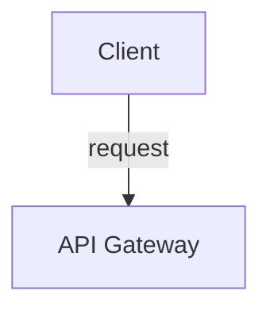

# Agora Canvas API

Reference for all visual commands, inline chat components, and interactive patterns available in Agora Agent UI.

## Delivery Methods

### HTML Comments (fire-and-forget)

Embed commands as HTML comments in your text response. The server auto-extracts them, routes to the canvas, and strips them from the displayed text.

**Canvas visual commands** — appear in the visual panel (right side):
```
<!-- canvas:diagram: {"format":"mermaid","content":"graph TD\n  A-->B","animate":true} -->
<!-- canvas:html: {"html":"<div style=\"text-align:center\"></div>"} -->
<!-- canvas:web-embed: {"url":"https://example.com","title":"Reference"} -->
<!-- canvas:celebrate: {"type":"xp","xpAwarded":20} -->
<!-- canvas:dashboard: {"progress":{"completed":5,"total":10}} -->
<!-- canvas:code: {"language":"javascript","code":"function add(a,b) {...}","tests":[...]} -->
```

**Mermaid diagrams** — a fenced code block auto-routes to `canvas:diagram`:
````

````

**Inline chat components** — render inside the chat bubble:
```
<!-- buttons: {"id":"choice-1","type":"single","prompt":"Pick:","options":[{"label":"Option A","value":"I choose A"},{"label":"Option B","value":"I choose B"}]} -->
<!-- list: {"id":"topics","style":"cards","items":[{"icon":"book","title":"Title","description":"Desc","action":"message on click"}]} -->
<!-- progress: {"id":"prog","label":"Step","current":3,"total":7,"style":"bar"} -->
<!-- card: {"id":"tip-1","type":"tip","title":"Pro Tip","content":"Markdown content here."} -->
<!-- code: {"id":"code-1","language":"js","code":"const x = 1;","highlight":[1]} -->
<!-- steps: {"id":"steps-1","current":2,"steps":[{"label":"Setup","status":"done"},{"label":"Build","status":"active"},{"label":"Deploy","status":"pending"}]} -->
<!-- suggestions: [{"label":"Continue","text":"Continue"},{"label":"Help","text":"I need help"}] -->
```

**Rules:**
- Canvas commands are stripped from the displayed text — the user sees only the rendered component
- Inline blocks and buttons render inside the chat bubble
- Suggestions render as chips at the bottom of chat
- Use this approach for ALL fire-and-forget commands

### curl with await (interactive)

For commands that need the user's response back, use `curl POST /api/canvas` with the `await` field. This blocks until the user completes the interaction or the timeout expires.

```bash
RESULT=$(curl -s --max-time 65 -X POST http://localhost:PORT/api/canvas \
  -H "Content-Type: application/json" \
  -d '{"v":1,"type":"canvas:code","payload":{"language":"javascript","code":"function add(a,b) { }","tests":[{"input":"add(2,3)","expected":"5"}]},"source":"plugin","timestamp":'$(date +%s000)',"await":{"event":"event:code-run","timeout":60}}')
```

**JSON envelope format:**
```json
{
  "v": 1,
  "type": "<message-type>",
  "payload": { ... },
  "source": "plugin",
  "timestamp": 1234567890000,
  "await": { "event": "<event-type>", "timeout": 30 }
}
```

Use curl + await when you need a response from the user's interaction. Use HTML comments for everything else.

## Canvas Visual Commands

### Diagrams (canvas:diagram)

Embed Mermaid diagrams to visualize concepts, architectures, and flows.

```
<!-- canvas:diagram: {"format":"mermaid","content":"graph TD\n  A[Client] -->|request| B[Server]"} -->
```

Or use a fenced mermaid code block (auto-routed). The diagram panel supports zoom (mouse wheel), pan (click-and-drag), and fit-to-canvas controls.

Guidelines:
- `content` must start with a valid Mermaid keyword: `graph`, `flowchart`, `sequenceDiagram`, `classDiagram`, `stateDiagram-v2`, `erDiagram`, `gantt`, `pie`, `mindmap`, `timeline`, `gitGraph`
- Never send plain text as `content` — it must be valid Mermaid syntax

### Rich HTML (canvas:html)

Show images, videos, and custom HTML in the visual panel.

```
<!-- canvas:html: {"html":"<div style=\"text-align:center\"><p style=\"color:#8b949e;margin-top:8px\">Caption</p></div>"} -->
```

YouTube embed:
```
<!-- canvas:html: {"html":"<div style=\"position:relative;padding-bottom:56.25%;height:0\"><iframe src=\"https://www.youtube.com/embed/VIDEO_ID\" style=\"position:absolute;top:0;left:0;width:100%;height:100%;border:0;border-radius:8px\" allowfullscreen></iframe></div>"} -->
```

Media URLs (YouTube, Vimeo, images, videos) in your text are auto-detected and routed to the canvas with "Open" links.

### Web Embeds (canvas:web-embed)

Embed external websites for reference or inspection.

```
<!-- canvas:web-embed: {"url":"https://example.com","title":"Reference Docs"} -->
```

Sites with `X-Frame-Options: DENY` show a fallback "Open in new tab" button.

### Celebrations (canvas:celebrate)

```
<!-- canvas:celebrate: {"type":"xp","xpAwarded":20} -->
```

Types: `"xp"` (confetti), `"level-up"`, `"perfect-score"` (extra confetti).

## Inline Chat Components

### Smart Buttons

Clickable buttons inside the chat bubble for user choices.

| Type | Behavior | Use case |
|---|---|---|
| `single` | Click one → sends its value | Topic selection, yes/no |
| `multi` | Check multiple → Submit → sends comma-joined values | "Which apply?" |
| `rating` | Click rating → sends its value | Confidence, difficulty |

```
<!-- buttons: {"id":"unique-id","type":"single","prompt":"Choose an option:","options":[{"label":"Option A","value":"I choose A"},{"label":"Option B","value":"I choose B"}]} -->
```

### Smart List

Styled list with icons, descriptions, and optional click actions.

| Style | Rendering | Best for |
|---|---|---|
| `cards` | Card grid with icons | Topic menus, feature lists |
| `numbered` | Ordered with number badges | Step-by-step instructions |
| `checklist` | Checkbox items | Task lists |
| `compact` | Dense single-line items | Quick references |

```
<!-- list: {"id":"unique-id","style":"cards","items":[{"icon":"book","title":"Title","description":"Desc","action":"message on click"}]} -->
```

Items with `action` are clickable — clicking sends the action text as a user message.

### Progress Bar

| Style | Rendering | Best for |
|---|---|---|
| `bar` | Horizontal fill bar | General progress |
| `steps` | Numbered step dots | Walkthrough position |
| `ring` | Circular percentage | Overall completion |

```
<!-- progress: {"id":"unique-id","label":"Progress","current":3,"total":7,"style":"bar"} -->
```

### Info Card

| Type | Color | Use case |
|---|---|---|
| `tip` | Blue | Best practices, shortcuts |
| `warning` | Yellow | Common mistakes, gotchas |
| `error` | Red | Critical errors |
| `success` | Green | Correct answers, achievements |
| `concept` | Purple | Key definitions |

```
<!-- card: {"id":"unique-id","type":"tip","title":"Pro Tip","content":"Markdown content here."} -->
```

### Code Snippet

Syntax-highlighted code block with optional filename and line highlighting.

```
<!-- code: {"id":"unique-id","language":"javascript","filename":"app.js","code":"const x = 1;\nconsole.log(x);","highlight":[1]} -->
```

### Step Tracker

Visual step-by-step tracker. Each step has status: `done`, `active`, or `pending`.

```
<!-- steps: {"id":"unique-id","current":2,"steps":[{"label":"Setup","status":"done"},{"label":"Build","status":"active"},{"label":"Deploy","status":"pending"}]} -->
```

### Suggestion Chips

Navigation chips at the bottom of chat. Must be the last thing in your message.

```
<!-- suggestions: [{"label":"Continue","text":"Continue"},{"label":"Help","text":"I need help"},{"label":"Show diagram","text":"Show me a diagram"}] -->
```

Rules:
- 3-5 chips per response
- Pick chips relevant to the current context
- Must be the last comment in the message

## Component Ordering

Place components in this order within a response:

1. **Step tracker / Progress bar** — orientation ("you are here") goes first
2. **Text + cards + lists + diagrams + code** — content in the middle
3. **Question + buttons** — interactive prompt near the bottom
4. **Suggestion chips** — always last

## Tier Detection

Check the current tier to determine visual capabilities:

```bash
TIER_RESPONSE=$(curl -s --max-time 2 http://localhost:PORT/api/tier 2>/dev/null)
```

- `"tier":1` or `"tier":2` → visual commands available
- `"tier":3` or failure → terminal-only mode, skip all visual commands

## Event Polling

For checking user events without `await`:

```bash
# Instant poll
curl -s http://localhost:PORT/api/events

# Long-poll (blocks until event or timeout)
curl -s "http://localhost:PORT/api/events/wait?timeout=30000"
```

## Auto-Enhancement

Plain markdown patterns are automatically upgraded to rich components:

- `> **Pro Tip:** ...` → tip card
- `> **Warning:** ...` → warning card
- Numbered lists with `**bold titles**` → numbered list component
- Bullet lists with `**bold titles**` → card-style list component

This only applies when the message contains no existing smart component comments.
